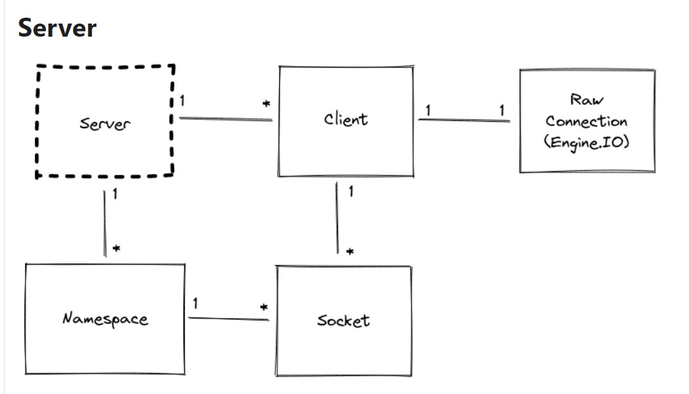

## OSI Model (Open Systems Interconnection)

#### has 7 layers
- Physical Layer
- Data Link Layer
- Network Layer 
- Transport Layer
- Session Layer
- Presentation Layer
- Application Layer

## Socket.io Documentation

#### Socket.IO is a library that enables low-latency, bidirectional and event-based communication between a client and a server.
  
#### features provided by Socket.IO over plain WebSockets:
- HTTP long-polling fallback
- Automatic reconnection
- Packet buffering
- Acknowledgements
- Broadcasting
- Multiplexing

 
